![[bmeLogo.jpg|center|300]] 
<center>
	<h4>Faculty of Electrical Engineering and Informatics</h4>
	<br><br><br><br><br><br><br><br><br><br><br><br>
	<h2>Basics of Programming 3</h2>
	<h1>Graphing Calculator Application</h1>
	<h3>Documentation</h3>
	<br><br><br><br><br><br><br><br><br><br><br><br><br><br>
	 Student
	<h5>Klevis Imeri T4XGKO</h5>
	Budapest, October, 2023
</center>

<div style="page-break-after: always;"></div>

# Main.java
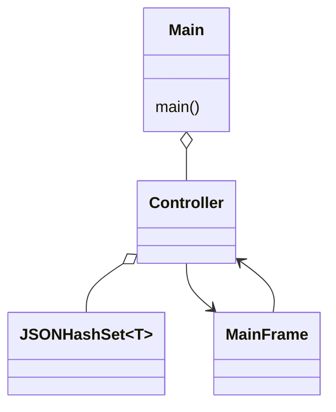

#### Main Method
```java
  public static void main(String[] args) {
    JSONHashSet<Expression> functions = new JSONHashSet<>(Expression.class);
    Controller controler = new Controller(functions);
    MainFrame frame = new MainFrame(controler);
  }
```

- **Creating Expression Set:**
    - `JSONHashSet<Expression> functions = new JSONHashSet<>(Expression.class);`
    - We create a set (`functions`) to hold objects of the `Expression` class using a specialized set called `JSONHashSet`.
- **Creating Controller:**
    
    - `Controller controller = new Controller(functions);`
    - We make a `Controller` instance and give it our set of `Expression` objects (`functions`) so that it can manage and control operations related to these expressions.
- **Creating Main Frame:**
    
    - `MainFrame frame = new MainFrame(controller);`
    - We create the main user interface (`frame`) and link it to the `Controller`. This implies that the UI interacts with the `Controller`.
    - 
<div style="page-break-after: always;"></div>

# Data Package
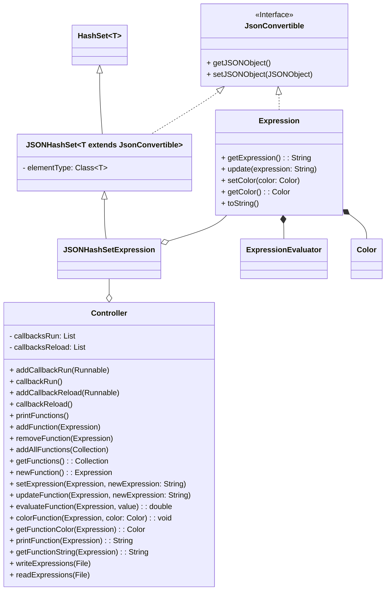
> [!warning] Only the controller communicates with the outside world

### JsonConvertible Interface

```java
interface JsonConvertible {
    JSONObject getJSONObject();
    void setJSONObject(JSONObject jsonObject);
}
```

This `JsonConvertible` interface defines a contract for classes that can be converted to and from JSON representation. Here's an explanation of the methods in the interface:

1. **`getJSONObject()`:**
   - **Return Type:** `JSONObject`
   - **Description:** This method is intended to retrieve a `JSONObject` representation of the implementing class. It should convert the object's state into a JSON format.

2. **`setJSONObject(JSONObject jsonObject)`:**
   - **Parameters:** `jsonObject` - A `JSONObject` to set the state of the implementing class.
   - **Description:** This method is designed to set the state of the implementing class based on the information provided in the given `JSONObject`. It essentially reconstructs the object from its JSON representation.

In summary, any class that implements the `JsonConvertible` interface must provide methods to convert its state to a `JSONObject` and to reconstruct its state from a `JSONObject`. This allows objects of such classes to be easily serialized to JSON and deserialized from JSON.

### Expression Class
```java
public class Expression implements JsonConvertible {
	//Fields 
    private ExpressionEvaluator evaluator;
    private Color color;

	//Constructors 
    public Expression() {}
    public Expression(String expression) throws Exception {}
    public Expression(Color color) {}
    public Expression(String expression, Color color) throws Exception {}

	//Parsing
    public String getExpression() {}
    public void update(String expression) throws Exception {}

	//Coloring
    public void setColor(Color color) {}
    public Color getColor() {}

	//JsonConvertible 
    @Override
    public JSONObject getJSONObject() {}
    
    @Override
    public void setJSONObject(JSONObject jsonObject) {}

    private JSONArray colorToJSONArray(Color color) {}
    private Color JSONArrayToColor(JSONObject jsonObject) {}

	//Printing
    @Override
    public String toString() {}
}
```
1. **Fields:**
   - `evaluator`: An instance of the `ExpressionEvaluator` class, used to parse and evaluate mathematical expressions.
   - `color`: An instance of the `Color` class representing the color associated with the expression.

2. **Constructors:**
   - `Expression()`: Default constructor, initializes the expression with default values.
   - `Expression(String expression) throws Exception`: Constructor that takes an expression as a parameter and updates the internal state of the `Expression` instance. It also does the parsing therefore it can return Exception.
   - `Expression(Color color)`: Constructor that sets the color of the expression.
   - `Expression(String expression, Color color) throws Exception`: Constructor that takes both an expression and a color, updating the internal state accordingly.

3. **Methods:**
   - `getExpression()`: Retrieves the mathematical expression associated with the instance.
   - `update(String expression) throws Exception`: Updates the expression, parsing and setting the new mathematical expression.
   - `setColor(Color color)`: Sets the color associated with the expression.
   - `getColor()`: Retrieves the color of the expression.
   - `getJSONObject()`: Implements the `JsonConvertible` interface, returning a `JSONObject` representation of the expression.
   - `setJSONObject(JSONObject jsonObject)`: Implements the `JsonConvertible` interface, setting the state of the expression based on a provided `JSONObject`.
   - `colorToJSONArray(Color color)`: Converts the `Color` instance to a `JSONArray` for JSON serialization.
   - `JSONArrayToColor(JSONObject jsonObject)`: Converts a `JSONArray` from JSON to a `Color` instance.
   - `toString()`: Overrides the `toString` method to provide a string representation of the expression, including the mathematical expression and color.

In summary, the `Expression` class represents a mathematical expression with associated color. It can be updated, serialized to JSON, and has methods for retrieving and manipulating its state. The `Expression` class also implements the `JsonConvertible` interface, allowing it to be easily converted to and from JSON format.

### JSONHashSet\<T extends JsonConvertible\> Class 
```java
public class JSONHashSet<T extends JsonConvertible> extends HashSet<T> implements JsonConvertible {
	//Fields 
    private final Class<T> elementType;

	//Constructor
    public JSONHashSet(Class<T> elementType) {}

	//JsonConvertible
    @Override
    public JSONObject getJSONObject() {}
    @Override
    public void setJSONObject(JSONObject jsonObject) {}
}
```
A specialized HashSet designed for storing objects that implement the `JsonConvertible` interface. This class extends the standard HashSet and implements the `JsonConvertible` interface. It allows for recurse serialization of Json.

- **Fields**
	- `elementType`: The `class<T>` of the elements stored in the set.
- **Constructors**
	- `JSONHashSet(Class\<T\> elementType)`: Creates a new instance of `JSONHashSet` with the specified element type.
- **Methods**
	- `getJSONObject()`: Converts the set of `JsonConvertible` objects to a JSONObject.
	- `setJSONObject(JSONObject jsonObject)`: Sets the state of the set based on the provided JSONObject. Clears the existing set and adds elements based on the JSON array.


### Controller Class
```java
public class Controller {
    private JSONHashSet<Expression> functions;
    private List<Runnable> callbacksRun;
    private List<Runnable> callbacksReload;

    //Callback methods
    public Controller(JSONHashSet<Expression> functions) {}
    public void addCallbackRun(Runnable callback) {}
    private void callbackRun() {}
    public void addCallbackReload(Runnable callback) {}
    private void callbackReload() {}

    //Collection methods
    public void printFuntions() {}
    public void addFunction(Expression function) {}
    public void removeFunction(Expression function) {}
    public void addAllFunctions(Collection<Expression> c) {}
    public Collection<Expression> getFunctions() {}

    //Expression methods
    public Expression newFunction() {}
    public void setExpression(Expression function, String newExpression) {}
    public void updateFuntion(Expression function,  String newExpression) throws Exception {}
    public double evaluateFuntion(Expression function, double value) throws Exception {}
    public void colorFunction(Expression function, Color color) {}
    public Color getFunctionColor(Expression function) {}
    public String printFuntion(Expression function) {}
    public String getFunctionString(Expression function) {}
    
    //Write Read methods
    public void writeExpressions(File file) {}
    public void readExpressions(File file) {}
}
```
  A class that manages expressions, providing methods for handling expressions, callback registration, and JSON serialization.

  - **Fields**
    - `functions:` A set of expressions stored in a `JSONHashSet`.
    - `callbacksRun:` List of callbacks to be executed when a run event occurs.
    - `callbacksReload:` List of callbacks to be executed when a reload event occurs.

  - **Constructor**
    - `Controller(JSONHashSet<Expression> functions):` Initializes the Controller with a set of expressions.

  - **Callback Methods**
    - `addCallbackRun(Runnable callback):` Adds a callback to be executed during a run event.
    - `callbackRun():` Executes all callbacks registered for run events.
    - `addCallbackReload(Runnable callback):` Adds a callback to be executed during a reload event.
    - `callbackReload():` Executes all callbacks registered for reload events and triggers run callbacks.

  - **Collection Methods**
    - `printFunctions():` Prints the string representation of all stored expressions.
    - `addFunction(Expression function):` Adds an expression to the set and triggers run callbacks.
    - `removeFunction(Expression function):` Removes an expression from the set and triggers run callbacks.
    - `addAllFunctions(Collection<Expression> c):` Adds a collection of expressions to the set and triggers run callbacks.
    - `getFunctions():` Returns an unmodifiable collection of expressions.

  - **Expression Methods**
    - `newFunction():` Creates a new expression and adds it to the set, triggering run callbacks.
    - `setExpression(Expression function, String newExpression):` Sets the mathematical expression for an expression.
    - `updateFunction(Expression function, String newExpression):` Updates the mathematical expression for an expression and triggers run callbacks.
    - `evaluateFunction(Expression function, double value):` Evaluates an expression for a given value.
    - `colorFunction(Expression function, Color color):` Sets the color for an expression and triggers run callbacks.
    - `getFunctionColor(Expression function):` Gets the color of an expression.
    - `printFunction(Expression function):` Returns a string representation of an expression.
    - `getFunctionString(Expression function):` Gets the mathematical expression of an expression.

  - **Write Read Methods**
    - `writeExpressions(File file):` Writes the expressions to a JSON file.
    - `readExpressions(File file):` Reads expressions from a JSON file, triggers reload callbacks.
    - 


<div style="page-break-after: always;"></div>

# ExpressionEvaluator Package 
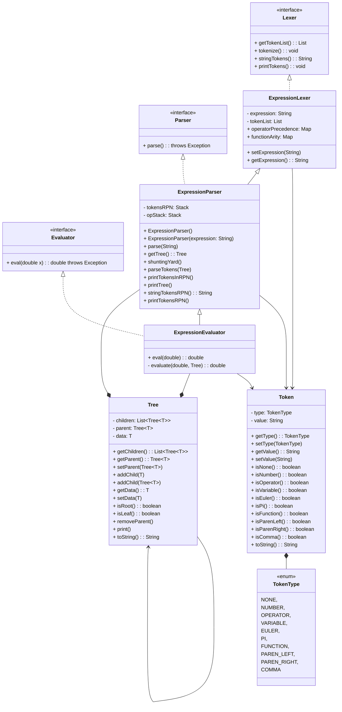

> This separation into interfaces is done because the program in the future may contain different kind of parsers. An example is a latex parser.
## Interfaces
### Lexer Interface 
```java
public interface Lexer {
    public List<Token> getTokenList();
    void tokenize() throws Exception;
    String stringTokens();
    void printTokens();
}
```
  - **Methods:**
    - **`public List<Token> getTokenList()`**
      - *Description:* Returns the list of tokens generated by the lexer.
      - *Return Type:* `List<Token>`

    - **`void tokenize() throws Exception`**
      - *Description:* Tokenizes the input expression.
      - *Throws:* `Exception` - If an error occurs during tokenization.

    - **`String stringTokens()`**
      - *Description:* Returns a string representation of the tokens.
      - *Return Type:* `String`

    - **`void printTokens()`**
      - *Description:* Prints the tokens generated by the lexer to the console.

### Parser Interface 
```java
public interface Parser {
    void parse() throws Exception;
}
```
  - **Methods:**

    - **`void parse() throws Exception`**
      - *Description:* Parses the expression.
      - *Throws:* `Exception` - If an error occurs during parsing.

### Evaluator Interface 
```java
public interface Evaluator {
    double eval(double x) throws Exception;  
}
```
  - **Method: `double eval(double x) throws Exception`**
    - *Description:* Evaluates the expression for the given value.
    - *Parameters:*
      - `x` (type `double`): The value for which the expression is evaluated.
    - *Throws:* `Exception` - If an error occurs during evaluation.

## Implementation 'Expression'
### ExpressionLexer Class
```java
public class ExpressionLexer implements Lexer {

    // Attributes
    protected String expression;
    protected int Paren_left;
    protected int Paren_right;
    protected List<Token> tokenList;
    protected final Map<Character, Integer> operatorPrecedence;
    protected final Map<String, Integer> functionArity;

    // Constructors, Setters, Getters
	public ExpressionLexer() {}
	public ExpressionLexer(String expression) {}
	public void setExpression(String expression) {}
	public String getExpression(){}
	 public List<Token> getTokenList() {}
	
    // Helper functions
    private TokenType getTokenTypeOfLastElement();
    private boolean isDigit(int i);
    private void addMultiplicationSign();
    private boolean isLastTokenNumber(int i);
    private boolean isLastTokenDivisonOperator(int i);
    private boolean isValidCharForNaming(int i);
    private boolean isCurrentTokenRightParen(int i);
    private boolean isLastTokenVariable(int i);

    // Tokenize functions
    private int tokenizeAdditonOrSubtraction(int i) throws IllegalArgumentException;
    private int tokenizeMultiplicatoinDivisionOrPower(int i) throws IllegalArgumentException;
    private int tokenizeNumber(int i) throws IllegalArgumentException;
    private int tokenizeVariable(int i);
    private int tokenizeFucntionOrConstant(int i) throws IllegalArgumentException;
    private int tokenizeParenLeft(int i) throws IllegalArgumentException;
    private int tokenizeParenRight(int i) throws IllegalArgumentException;
    private int tokenizeComma(int i) throws IllegalArgumentException;
    public void tokenize() throws Exception;
    private void validateArityOfFunction(int i) throws IllegalArgumentException;

    // Print functions
    public String stringTokens();
    public void printlistTokens();
    public void printTokens();
}

```
  - **Fields:**
    - `expression` (type `String`): Stores the mathematical expression.
    - `Paren_left` (type `int`): Counts the number of left parentheses.
    - `Paren_right` (type `int`): Counts the number of right parentheses.
    - `tokenList` (type `List<Token>`): Stores the list of tokens parsed from the expression.
    - `operatorPrecedence` (type `Map<Character, Integer>`): Stores the precedence number of each operator.
    - `functionArity` (type `Map<String, Integer>`): Stores the arity of each supported function.
    
  - **Constructor:**
    - `ExpressionLexer()`: Initializes the operator precedence and function arity maps, sets the expression to null.
    - `ExpressionLexer(String expression)`: Calls the default constructor and sets the expression to the provided value.

  - **Methods:**
    - `setExpression(String expression)`: Sets the value of the `expression` attribute.
    - `getExpression()`: Returns the value of the `expression` attribute.
    - `getTokenList()`: Returns the list of tokens.
    - `stringTokens()`: Returns a string representation of the token list.
    - `printlistTokens()`: Prints the string representation of the token list.
    - `printTokens()`: Prints a formatted representation of the lexer object.

  - **Helper Methods:**
    - `getTokenTypeOfLastElement()`: Returns the type of the last token in the token list.
    - `isDigit(int i)`: Checks if the character at the given index is a digit.
    - `addMultiplicationSign()`: Adds a multiplication sign to the token list based on the last element.
    - `isLastTokenNumber(int i)`: Checks if the last token is a number.
    - `isLastTokenDivisonOperator(int i)`: Checks if the last token is a division operator.
    - `isValidCharForNaming(int i)`: Checks if the character at the given index is valid for naming.
    - `isCurrentTokenRightParen(int i)`: Checks if the current token is a right parenthesis.
    - `isLastTokenVariable(int i)`: Checks if the last token is a variable.

  - **Tokenize Methods:**
    - `tokenizeAdditonOrSubtraction(int i)`: Tokenizes addition or subtraction operators.
    - `tokenizeMultiplicatoinDivisionOrPower(int i)`: Tokenizes multiplication, division, or power operators.
    - `tokenizeNumber(int i)`: Tokenizes numeric values.
    - `tokenizeVariable(int i)`: Tokenizes variables.
    - `tokenizeFucntionOrConstant(int i)`: Tokenizes functions or constants.
    - `tokenizeParenLeft(int i)`: Tokenizes left parentheses.
    - `tokenizeParenRight(int i)`: Tokenizes right parentheses.
    - `tokenizeComma(int i)`: Tokenizes commas.
    - `tokenize()`: Tokenized the whole expression. Uses all the other tokenize methods. If the expression is not in the right format it throughs an exception.

  - **Validation Methods:**
    - `validateArityOfFunction(int i)`: Validates the arity of a function.

  - **Exception Handling:**
    - Throws exceptions for mismatched parentheses, consecutive operators, incorrect function arity, and other parsing errors.

### ExpressionParser Class
```java
public class ExpressionParser extends ExpressionLexer implements Parser {

    // Fields
    protected Tree<Token> tree;
    protected Stack<Token> tokensRPN;
    protected Stack<Token> opStack;

    // Constructors, Setters, Getters
    public ExpressionParser() {}
    public ExpressionParser(String expression) throws Exception {}
	public Tree<Token> getTree()
	
	// Helper Methods 
    private boolean tokenHasLowerOrEqualPrecedenceThanTheTopOperatorInStack(Token token);
    private boolean isNextOperatorPopable(Token token);
    private boolean isNextPopable(Token token);
    private boolean isNextToRightParenAFunction(Token token);
    private boolean isNextToRightParenEmtyOrLeftParen(Token token);
    
    // Methods
    public void parse() throws Exception;
    public void parse(String expression) throws Exception;
    public void shuntingYard() throws Exception;
    public void parseTokens(Tree<Token> node) throws IllegalArgumentException;
    
    //Print Methods
    public void printTokensInRPN();
    public void printTree();
    public String stringTokensRPN();
    public void printTokensRPN();
    public String treeToString();
}

```

It extends the Lexer because you first need to create the Tokens and then you can parser so more freely. 
  - **Attributes:**
    - `tree` (type `Tree<Token>`): Represents the expression tree.
    - `tokensRPN` (type `Stack<Token>`): Stores tokens in Reverse Polish Notation (RPN) during the shunting yard algorithm.
    - `opStack` (type `Stack<Token>`): Stores operators during the shunting yard algorithm.

  - **Constructors:**
    - `ExpressionParser()`: Default constructor.
    - `ExpressionParser(String expression) throws Exception`: Calls the superclass constructor, tokenizes the expression, performs the shunting yard algorithm, and parses the tokens.

  - **Methods:**
    - `parse() throws Exception`: Clears existing data, tokenizes the expression, performs the shunting yard algorithm, and parses the tokens.
    - `parse(String expression) throws Exception`: Sets a new expression and calls the `parse()` method.
    - `getTree()`: Returns the expression tree.
    - `shuntingYard() throws Exception`: Implements the shunting yard algorithm to convert infix notation to RPN.
    - `parseTokens(Tree<Token> node) throws IllegalArgumentException`: Recursively parses tokens to build the expression tree.
    - `printTokensInRPN()`: Prints the tokens in RPN.
    - `printTree()`: Prints the expression tree.
    - `stringTokensRPN()`: Returns a string representation of tokens in RPN.
    - `printTokensRPN()`: Prints the string representation of tokens in RPN.
    - `treeToString()`: Returns a string representation of the expression tree.

  - **Helper Methods:**
    - `tokenHasLowerOrEqualPrecedenceThanTheTopOperatorInStack(Token token)`: Checks if a token has lower or equal precedence than the top operator in the stack.
    - `isNextOperatorPopable(Token token)`: Checks if the next operator is popable from the stack.
    - `isNextPopable(Token token)`: Checks if the next token is popable from the stack.
    - `isNextToRightParenAFunction(Token token)`: Checks if the next token to a right parenthesis is a function.
    - `isNextToRightParenEmtyOrLeftParen(Token token)`: Checks if the next token to a right parenthesis is empty or a left parenthesis.

### ExpressionEvaluator Class
```java
public class ExpressionEvaluator extends ExpressionParser implements Evaluator {
    // Methods
    public double eval(double x) throws Exception;
    private double evaluate(double x, Tree<Token> node) 
    throws NullPointerException, IllegalArgumentException;
}
```

If you want to evaluate an expression you first need to parses therefore the Evaluator extends the ExpressionParser.
  - **Constructors:**
    - `ExpressionEvaluator()`: Default constructor.
    - `ExpressionEvaluator(String expression) throws Exception`: Calls the superclass constructor with the provided expression.
  - **Methods:**
    - `eval(double x) throws Exception`: Evaluates the expression for the given value of 'x'.
    - `private double evaluate(double x, Tree<Token> node) throws NullPointerException, IllegalArgumentException`: Recursively evaluates the expression tree.


## Helper Classes
### Token Class
```java
public class Token {
    private TokenType type;
    private String value;

    // Constructor
    public Token(TokenType type, String value);

    // Getters and Setters
    public TokenType getType();
    public void setType(TokenType type);
    public String getValue();
    public void setValue(String value);

    // Type-checking methods
    public boolean isNone();
    public boolean isNumber();
    public boolean isOperator();
    public boolean isVariable();
    public boolean isEuler();
    public boolean isPi();
    public boolean isFunction();
    public boolean isParenLeft();
    public boolean isParenRight();
    public boolean isComma();

    // Override toString method
    @Override
    public String toString();
}
```
  - **Fields:**
    - `private TokenType type`: Represents the type of the token.
    - `private String value`: Represents the value of the token.
  - **Constructor:**
    - `Token(TokenType type, String value)`: Initializes the token with the specified type and value.
  - **Methods:**
    - `getType()`: Returns the type of the token.
    - `setType(TokenType type)`: Sets the type of the token.
    - `getValue()`: Returns the value of the token.
    - `setValue(String value)`: Sets the value of the token.
    - `isNone()`: Checks if the token type is 'NONE'.
    - `isNumber()`: Checks if the token type is 'NUMBER'.
    - `isOperator()`: Checks if the token type is 'OPERATOR'.
    - `isVariable()`: Checks if the token type is 'VARIABLE'.
    - `isEuler()`: Checks if the token type is 'EULER'.
    - `isPi()`: Checks if the token type is 'PI'.
    - `isFunction()`: Checks if the token type is 'FUNCTION'.
    - `isParenLeft()`: Checks if the token type is 'PAREN_LEFT'.
    - `isParenRight()`: Checks if the token type is 'PAREN_RIGHT'.
    - `isComma()`: Checks if the token type is 'COMMA'.
    - `toString()`: Returns a string representation of the token.

### TokenType Enum
```java
public enum TokenType {
    NONE,
    NUMBER,
    OPERATOR,
    VARIABLE,
    EULER,
    PI,
    FUNCTION,
    PAREN_LEFT,
    PAREN_RIGHT,
    COMMA
}
```

It helps the Lexer in creation of the tokens so it can group them according to their properties. It helps the Parser with the order of precedence and algorithms (ShuntingYard).

### Tree\<T> Class 
```java
public class Tree<T> implements Serializable {
    private List<Tree<T>> children;
    private Tree<T> parent;
    private T data;

    // Constructors
    public Tree();
    public Tree(T data);
    public Tree(T data, Tree<T> parent);

    // Getters and Setters
    public List<Tree<T>> getChildren();
    public Tree<T> getParent();
    public void setParent(Tree<T> parent);
    public T getData();
    public void setData(T data);

    // Utility Methods
    public boolean isRoot();
    public boolean isLeaf();
    public void removeParent();

    // Print methods
    public void print();
    private void print(String prefix, boolean isTail);
    private StringBuilder treeToString(StringBuilder prefix, boolean isTail);
    public String toString();
}
```


  - **Fields:**
    - `private List<Tree<T>> children`: Represents the list of child nodes.
    - `private Tree<T> parent`: Represents the parent node.
    - `private T data`: Represents the data stored in the node.

  - **Constructors:**
    - `Tree()`: Initializes an empty tree.
    - `Tree(T data)`: Initializes a tree with the specified data.
    - `Tree(T data, Tree<T> parent)`: Initializes a tree with the specified data and parent.

  - **Methods:**
    - `getChildren()`: Returns the list of child nodes.
    - `getParent()`: Returns the parent node.
    - `setParent(Tree<T> parent)`: Sets the parent node.
    - `addChild(T data)`: Adds a child node with the specified data.
    - `addChild(Tree<T> child)`: Adds a child node.
    - `getData()`: Returns the data stored in the node.
    - `setData(T data)`: Sets the data stored in the node.
    - `isRoot()`: Checks if the node is a root node.
    - `isLeaf()`: Checks if the node is a leaf node.
    - `removeParent()`: Removes the parent node.
    - `print()`: Prints the tree structure.
    - `treeToString(StringBuilder prefix, boolean isTail)`: Converts the tree to a string representation.
    - `toString()`: Returns a string representation of the tree.


<div style="page-break-after: always;"></div>

# UI Package  
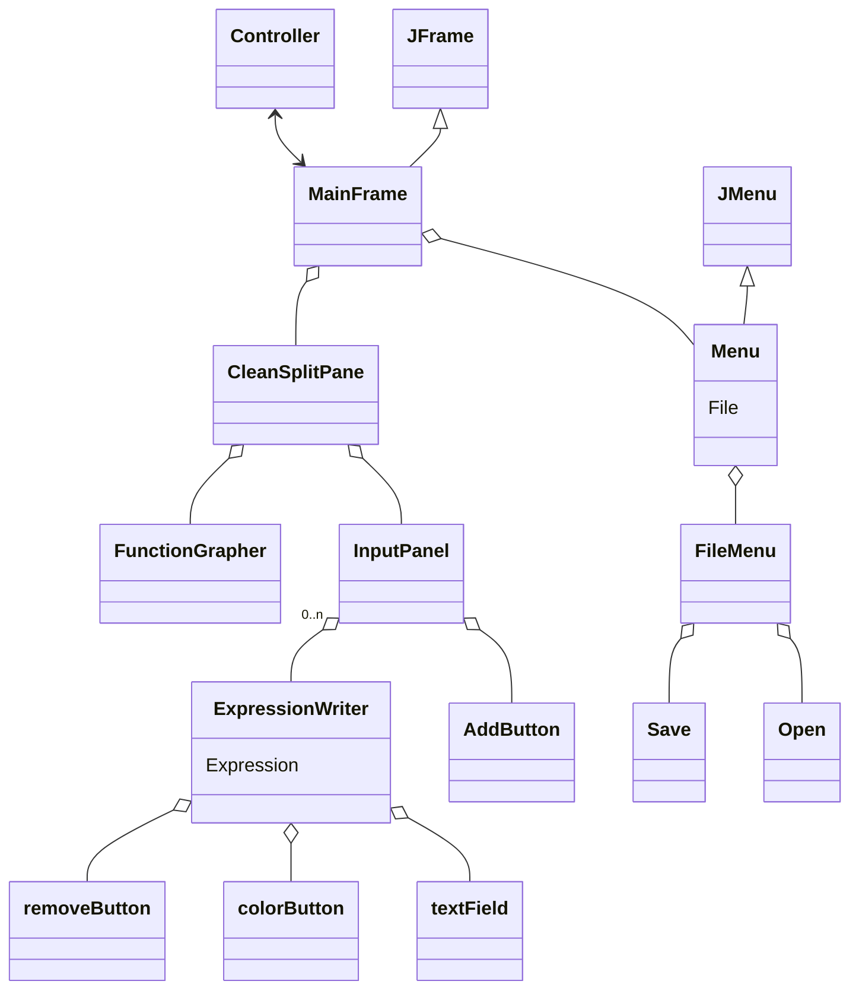

> [!warning] It is not shown but nearly all the classes communicate with the Controller.

## Important GUI classes

### Menu Class
```java
public class Menu extends JMenuBar {
	//Fields
    private Controller controller;
    private JMenu fileMenu;
    private JMenuItem openMenuItem;
    private JMenuItem saveMenuItem;
    private File file;
    private static final Color LIGHTBLACK;
    private static final Color BLACK;

    // Constructor
    public Menu(Controller controller);

    // Action methods
    void openFile();
    void saveFile();
    void saveAsFile();
    private boolean openFileChooser();
    private void askToSaveExistingFile();
}

```
  - **Fields:**
    - `private Controller controller`: Reference to the controller.
    - `private JMenu fileMenu`: Menu for file-related actions.
    - `private JMenuItem openMenuItem`: Menu item for opening a file.
    - `private JMenuItem saveMenuItem`: Menu item for saving a file.
    - `private File file`: Represents the current file.
    - `private static final Color LIGHTBLACK`: Constant color for a lighter black shade.
    - `private static final Color BLACK`: Constant color for black.

  - **Constructor: `Menu(Controller controller)`**

    - *Description:* Initializes the menu with the provided controller.

  - **Methods:**
    - `openFile()`: Opens a file, prompting to save existing changes if necessary.
    - `saveFile()`: Saves the file if it exists; otherwise, prompts to save as.
    - `saveAsFile()`: Prompts the user to save the file with a new name.
    - `openFileChooser()`: Opens a file chooser dialog for opening or saving a file.
    - `askToSaveExistingFile()`: Asks the user if they want to save the current file.

> When the file is open it delegates the work to the Controller to take care of the input or output file. The menu only takes care of the GUI for choosing the file.

### InputPanel Class
```java
public class InputPanel extends JPanel {

    // Field for the attribute
    private Controller controller;
    private AddButton addButton;

    // Constructor
    public InputPanel(Controller controller);

    // Methods
    public void update();
    public void addExpressionWriter(Expression function);
    public void removeExpressionWriter(ExpressionWriter expressionWriter);
}
```
  - **Fields:**
    - `private Controller controller`: Reference to the controller.
    - `private AddButton addButton`: Button for adding expressions.
  - **Constructor: `InputPanel(Controller controller)`**
    - *Description:* Initializes the input panel with the provided controller.
  - **Methods:**
    - `update()`: Updates the panel with the current expressions in the data.
    - `addExpressionWriter(Expression function)`: Adds an expression writer for the given function.
    - `removeExpressionWriter(ExpressionWriter expressionWriter)`: Removes an expression writer from the panel.

### ExpressionWriter 
```java
public class ExpressionWriter extends JPanel {

    // Fields for the attributes
    private Controller controller;
    private static Color darkmodeBackgroundColor;
    private FunctionTextField textField;
    private ColorButton colorButton;
    private Expression function;
    private RemoveButton removeButton;

    // Constructors
    public ExpressionWriter(
	    Controller controller, 
	    Consumer<ExpressionWriter> removeExpressionWriter
    );
    public ExpressionWriter(
	    Controller controller, 
	    Consumer<ExpressionWriter> removeExpressionWriter, 
	    Expression function
	);

    // Methods
    private void updateFunction();
    public void close();
}

```
- **Class: ExpressionWriter extends JPanel**
  - **Fields:**
    - `private Controller controller`: Reference to the controller.
    - `private FunctionTextField textField`: Text field for entering expressions.
    - `private ColorButton colorButton`: Button for selecting expression color.
    - `private Expression function`: Reference to the expression.
    - `private RemoveButton removeButton`: Button for removing the expression writer.
  - **Constructors:**
    - `ExpressionWriter(Controller controller, Consumer<ExpressionWriter> removeExpressionWriter)`: Initializes an expression writer.
    - `ExpressionWriter(Controller controller, Consumer<ExpressionWriter> removeExpressionWriter, Expression function)`: Initializes an expression writer with a specified function.
  - **Methods:**
    - `updateFunction()`: Updates the function based on the text field and color button.
    - `close()`: Closes the expression writer by deleting the data it corresponds using the Controller.


### FunctionGrapher Class 
```java
public class FunctionGrapher extends JPanel {

    // Fields for the attributes
    private Controller controller;
    private static Color darkmodeBackgroundColor;
    private int SCALE;
    private int divisionsSize;
    private int numberOfXdivisions;
    private int numberOfYdivisions;
    private int offsetX;
    private int offsetY;
    private int lastX;
    private int lastY;
    private int middleX;
    private int middleY;

    // Constructors
    public FunctionGrapher(Controller controller);

    // Listeners of the cartesian plane
    private void addZoomListener();
    private void addClickListener();
    private void addDragListener();
    private void addResizeListener();
    private void setListeners();

    // Override
    @Override
    protected void paintComponent(Graphics g);

    // Methods
    private void drawAxes(Graphics g);
    private void drawFunction(Graphics g, Expression function);
    private void drawAxisDivisions(Graphics g);
    public void setNumberOfXdivisions();
    public void setNumberOfYdivisions();
    public void setMiddleX();
    public void setMiddleY();
}
```
  - **Fields:**
    - `private Controller controller`: Reference to the controller.
    - `private int SCALE`: Scale factor for zooming.
    - `private int divisionsSize`: Size of axis divisions.
    - `private int numberOfXdivisions`: Number of divisions on the X-axis.
    - `private int numberOfYdivisions`: Number of divisions on the Y-axis.
    - `private int offsetX`: X-axis offset.
    - `private int offsetY`: Y-axis offset.
    - `private int lastX`: Last X-coordinate during mouse interaction.
    - `private int lastY`: Last Y-coordinate during mouse interaction.
    - `private int middleX`: Middle X-coordinate of the panel.
    - `private int middleY`: Middle Y-coordinate of the panel.

  - **Constructor:**
    - `FunctionGrapher(Controller controller)`: Initializes the function grapher with a controller.

  - **Methods:**
    - `addZoomListener()`: Adds a mouse wheel listener for zooming.
    - `addClickListener()`: Adds a mouse click listener for dragging.
    - `addDragListener()`: Adds a mouse drag listener for dragging.
    - `addResizeListener()`: Adds a component resize listener.
    - `setListeners()`: Sets all listeners for the function grapher.
    - `paintComponent(Graphics g)`: Paints the function grapher component. Draws the functions one in the data one by one using the controller.
    - `drawAxes(Graphics g)`: Draws X and Y axes.
    - `drawFunction(Graphics g, Expression function)`: Draws a function on the graph.
    - `drawAxisDivisions(Graphics g)`: Draws divisions on X and Y axes.
    - `setNumberOfXdivisions()`: Sets the number of divisions on the X-axis.
    - `setNumberOfYdivisions()`: Sets the number of divisions on the Y-axis.
    - `setMiddleX()`: Sets the middle X-coordinate of the panel.
    - `setMiddleY()`: Sets the middle Y-coordinate of the panel.

<div style="page-break-after: always;"></div>

# Sequence Diagrams for the use-cases
### Open File
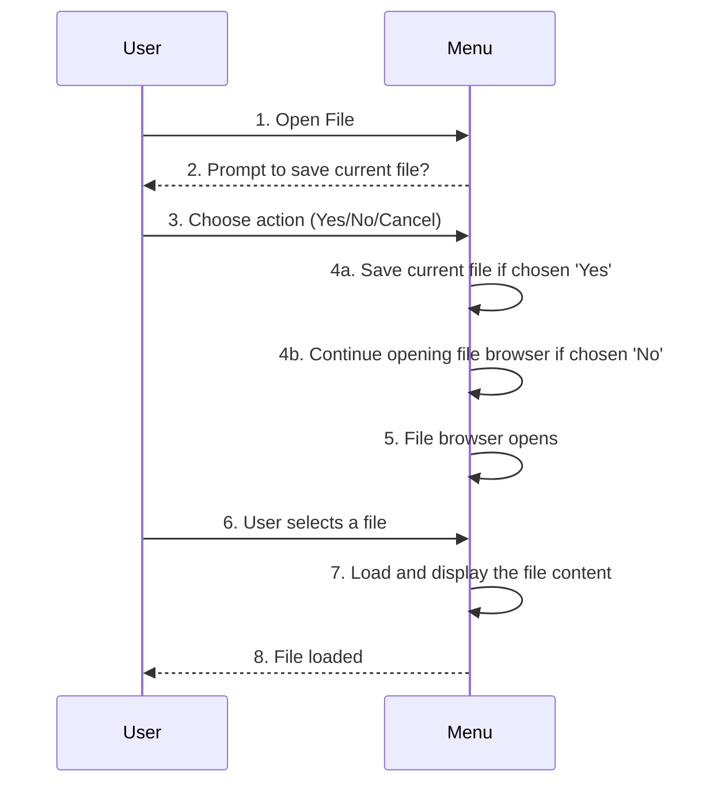
### New File
- It is created when the user starts the program.
- Or if during the program you can use `Open File` to open a New File.
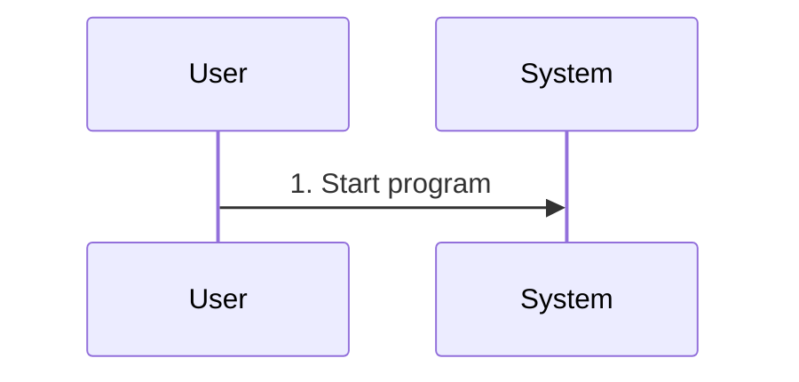
### Save File
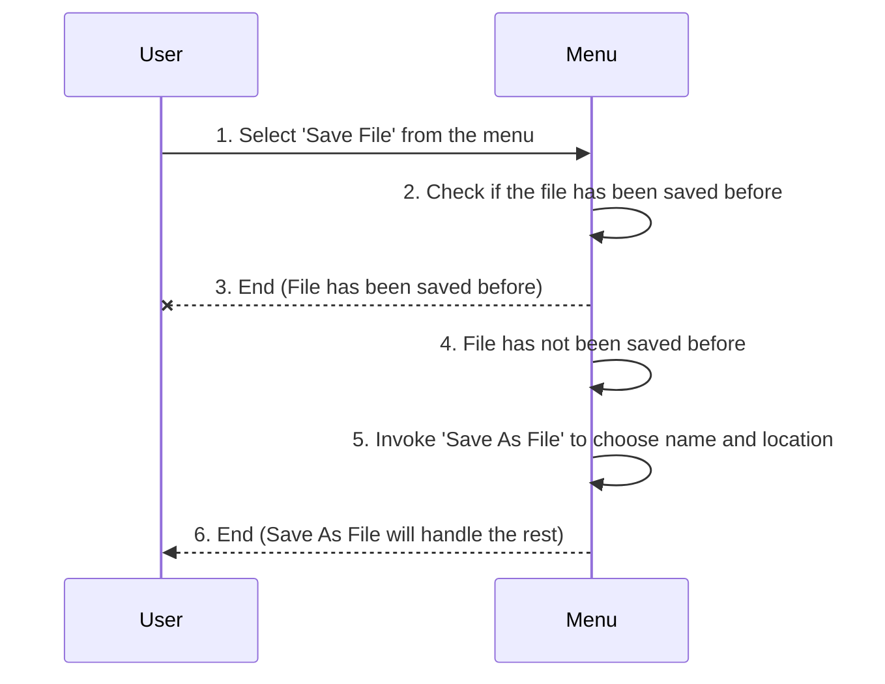
### Exit
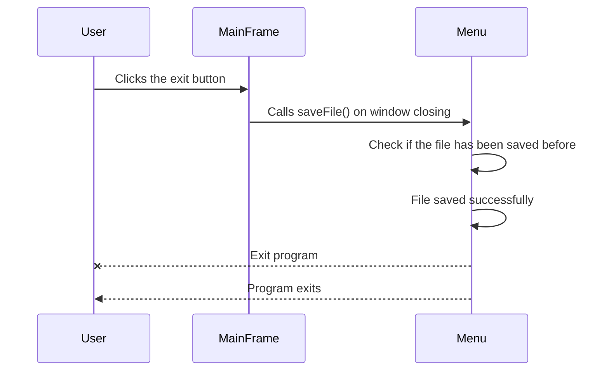
### Edit Expression 
- This is described using `Remove Expression`, `Write Expression`, and `Add Expression` in any order 
##### Add Expression
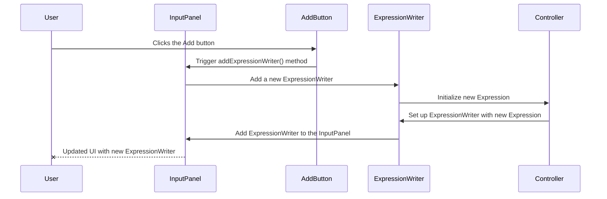
##### Write Expression
- It includes `Verify Expression` which is the alt state.
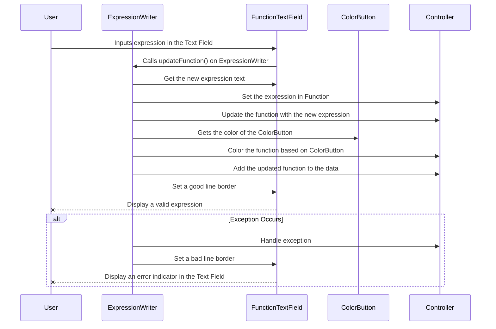
### Zoom
- It includes `Update Cartesian Plane`.
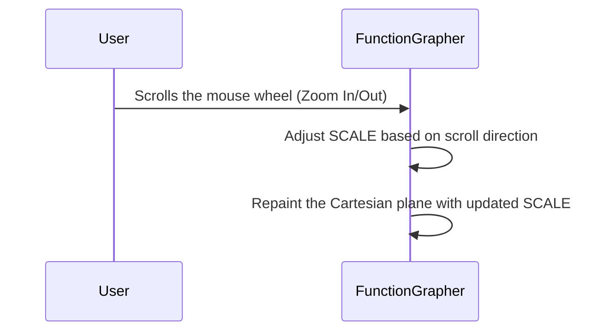

### Display Expression 
- It includes `Update Cartesian Plane`.
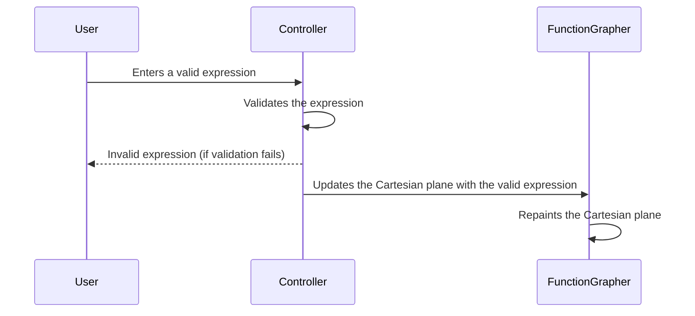

### Update Cartesian Plane
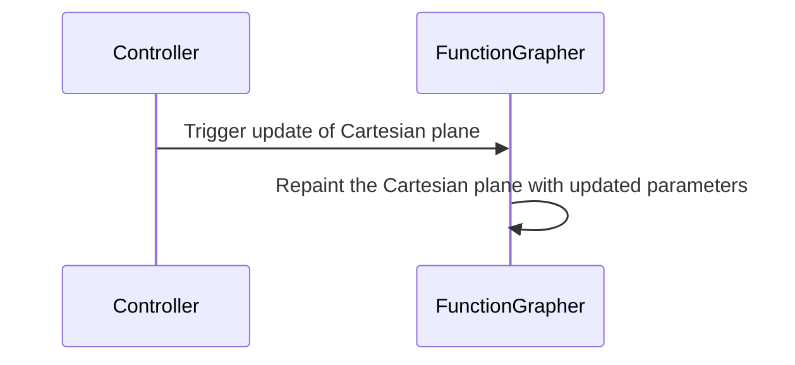


<div style="page-break-after: always;"></div>

# Description of the unit tests

### Parser Tests

**Purpose:**
The `TestParser` class is designed to test the functionality of the `ExpressionParser` class, specifically focusing on the parsing and evaluation of mathematical expressions. This set of tests covers various scenarios, including basic arithmetic operations, handling of variables, functions, constants, and complex expressions.

**Input and Expected Output**
   - *Input:* **String Expression**  
   - *Expected Tokenized Output:* **Array of tokens**
   - *Expected Reverse Polish Notation Output:* **Array of tokens in RPN**
   - *Expected Expression Tree:* **A string representation of the Tree.**
   
- Example **Power:**
    - *Input:* "x^3"
    - *Expected Tokenized Output:* "[{VARIABLE: x}, {OPERATOR: ^}, {NUMBER: 3}]"
    - *Expected Reverse Polish Notation Output:* "[{VARIABLE: x}, {NUMBER: 3}, {OPERATOR: ^}]"
    - *Expected Expression Tree:*
      ```
      └── {OPERATOR: ^}
          ├── {NUMBER: 3}
          └── {VARIABLE: x}
      ```
    - *Testing:* Verifies correct parsing of exponentiation.

   
**Testing Approach:**
- Each test case sets up an ExpressionEvaluator with a specific input expression.
- The tests verify the tokenization, conversion to Reverse Polish Notation (RPN), and the construction of the expression tree.
- Assertions are made to compare the expected and actual outputs at each stage of the parsing process.
```java
    @Test
    public void test() throws Exception {
        evaluator.tokenize();
        Assert.assertEquals(tokenized, evaluator.stringTokens());
        evaluator.shuntingYard();
        Assert.assertEquals(reversePolishNotation, evaluator.stringTokensRPN());
        evaluator.parseTokens(evaluator.getTree());
        Assert.assertEquals(tree, evaluator.treeToString());
    }
```

**Oracle:**
- The expected outputs for tokenization, RPN, and the expression tree are predefined based on the input expressions.
- Assertions in the test methods compare the actual outputs from the ExpressionEvaluator to these expected outputs.

### Expression Test 
**Purpose:**

The purpose of this set of JUnit tests is to validate the functionality of the `Expression` class, which presumably represents a mathematical expression associated with a color. The tests cover various methods of the `Expression` class, including getting the expression, updating the expression, setting and getting the color, and converting the object to and from JSON format.

**Testing Methods:**

1. **`testGetExpression`:**
   - **Input:** None (Implicitly uses the expression set during setup).
   - **Expected Output:** The expression retrieved using `getExpression` should match the initially set expression.

2. **`testUpdate`:**
   - **Input:** New expression ("3*x - 7").
   - **Expected Output:** After calling the `update` method, the expression retrieved using `getExpression` should match the updated expression.

3. **`testSetColor`:**
   - **Input:** New color (Color(50, 75, 100)).
   - **Expected Output:** After setting a new color using `setColor`, the color retrieved using `getColor` should match the expected new color.

4. **`testGetJSONObject`:**
   - **Input:** None (Implicitly uses the expression and color set during setup).
   - **Expected Output:** The JSON object created using `getJSONObject` should match the expected JSON structure constructed based on the initial setup.

5. **`testSetJSONObject`:**
   - **Input:** JSON object representing a new expression ("4*x - 3") and color ([80, 120, 160]).
   - **Expected Output:** After setting the object's state using `setJSONObject`, the expression retrieved using `getExpression` should match the expression from the input JSON, and the color should match the color from the input JSON.

**Testing Approach:**

- Each test focuses on a specific method or aspect of the `Expression` class.
- The initial setup creates an instance of `Expression` with a predefined expression and color.
- The tests modify and interact with the object using various methods.
- Assertions are used to compare the actual output with the expected output.
- If any assertion fails, it indicates a deviation from the expected behavior.

**Oracle:**

- The expected outcomes for each test are predefined based on the input provided or the initial setup.
- The Oracle for each test is the expected output against which the actual output is compared during the assertion step.
- Deviations from the expected outcomes, as indicated by failed assertions, highlight potential issues in the `Expression` class's implementation.

### Evaluator Tests 
**Purpose:**

The purpose of this JUnit test is to validate the correctness of the `ExpressionEvaluator` class for various mathematical functions. The test covers different types of functions, including trigonometric, logarithmic, exponential, and algebraic functions.

**Testing Methods:**

1. **`test`:**
   - **Input:** Values of `x` ranging from -100 to 100 in increments of 0.01.
   - **Expected Output:** The actual output from the `eval` method for the given function (`this.function`) should match the expected output calculated using the corresponding Java Math functions.

**Testing Approach:**

- The `@RunWith(Parameterized.class)` annotation is used to parameterize the tests with different mathematical functions.
- The `data` method provides an array of test cases, each containing a mathematical function as a string.
- The `setUp` method initializes the `ExpressionEvaluator` with the specified function before each test.
- The `test` method iterates through a range of `x` values and compares the actual output of the `eval` method with the expected output calculated using Java Math functions.
- Special cases (e.g., division by zero or infinity) are handled to avoid assertion errors.
- If expected output `>= 1e10` or `<= 1e-10` than it is ignored.

**Oracle:**

- The expected outcomes for each test are calculated using the equivalent Java Math functions corresponding to the specified mathematical expressions.
- Deviations from the expected outcomes, as indicated by failed assertions, highlight potential issues in the implementation of the `ExpressionEvaluator` class.

**Note:**
> Please note that the effectiveness of this test heavily depends on the correctness of the Java Math functions used as the oracle.

### Tree Test 
**Purpose:**

The purpose of these JUnit tests is to validate the functionality of the `Tree` class, ensuring that it correctly represents a tree structure and performs operations such as identifying root and leaf nodes, adding and removing child nodes, and generating a string representation of the tree.

**Testing Methods:**

1. **`testIsRoot`:**
   - **Input:** A tree with specified parent-child relationships.
   - **Expected Output:**
     - The root node (`root`) should be identified as the root.
     - The first child of the root should not be identified as the root.

2. **`testIsLeaf`:**
   - **Input:** A tree with specified parent-child relationships.
   - **Expected Output:**
     - The root node should not be identified as a leaf.
     - The first child of the root should be identified as a leaf.
     - The second child of the root should not be identified as a leaf.
     - The first child of the second child should be identified as a leaf.

3. **`testAddChildWithData`:**
   - **Input:** Adding a new child with data to the root.
   - **Expected Output:**
     - The new child should be added to the root's children.
     - The parent of the new child should be set to the root.

4. **`testRemoveParent`:**
   - **Input:** Removing the parent of a child.
   - **Expected Output:**
     - The parent of the specified child should be set to null.

5. **`testToString`:**
   - **Input:** A tree with specified parent-child relationships.
   - **Expected Output:**
     - The string representation of the tree should match the expected hierarchical structure.

**Testing Approach:**

- The `setUp` method creates a tree structure with specific nodes and relationships before each test.
- Each test method focuses on a specific aspect of the `Tree` class's functionality.
- Assertions are used to verify that the actual behavior matches the expected behavior.
